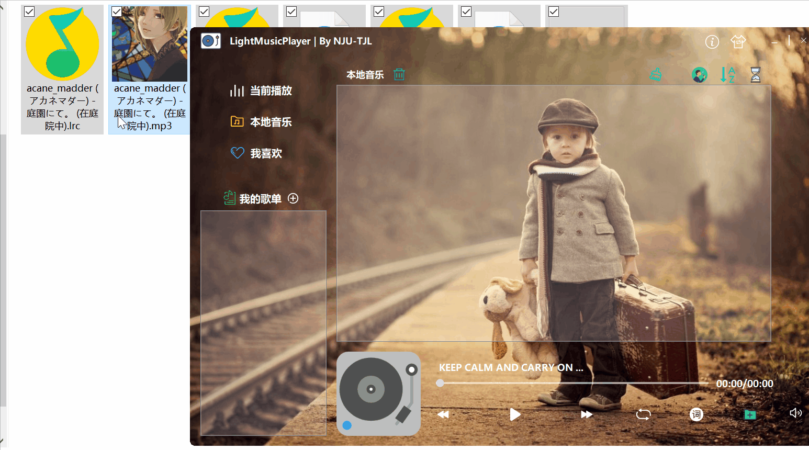
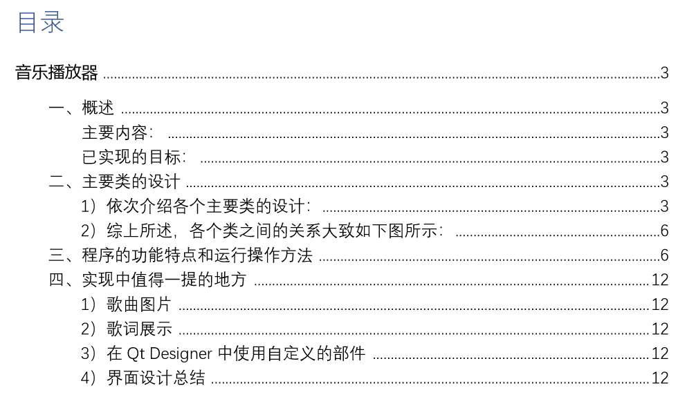

# LightMusicPlayer
*——南京大学2019秋季学期 “高级程序设计” 课程设计三*

基于Qt5开发的一个小巧精美的本地音乐播放器

PS：若**图片加载失败**，可访问CSDN博客查看：https://blog.csdn.net/Kingsman_T/article/details/103879947  或者  码云仓库：https://gitee.com/NJU-TJL/Qt5-MusicPlayer 

添加歌曲操作（自动过滤可播放类型文件）

**已实现的目标：**

- 界面精美且支持自定义背景
- 支持播放的音乐格式：.mp3文件、.flac文件、.mpga文件
- 支持解析并展示歌词文件（.lrc文件）
- 支持解析歌曲信息（专辑、比特率、缩略图等等）
- 支持歌单管理
- 系统托盘可控制播放
- 数据库保存已添加的歌曲和歌单信息

  

**环境：**

Qt5 （Qt Creator 4.8.2 + Qt 5.9.8 MinGW 32bit）  

**可执行程序下载地址：**

https://github.com/NJU-TJL/Qt5-MusicPlayer/releases

https://gitee.com/NJU-TJL/Qt5-MusicPlayer/releases/v1.0.0    （码云，国内下载速度更快）

****

**Copyright © 2020 NJU-TJL**  

**[开放源代码许可](https://github.com/NJU-TJL/Qt5-MusicPlayer/blob/master/LICENSE)**

**转载请注明原作者：https://github.com/NJU-TJL/Qt5-MusicPlayer**  

****

**设计详情请见于报告：**[点击下载](https://github.com/NJU-TJL/Qt5-MusicPlayer/raw/master/doc/%E8%AF%BE%E7%A8%8B%E8%AE%BE%E8%AE%A1%E6%8A%A5%E5%91%8A%20-%20%E9%9F%B3%E4%B9%90%E6%92%AD%E6%94%BE%E5%99%A8.pdf)

PS：这个项目是临近期末的一个课程设计，当时大概花了一两周的时间做，而代码量确实很大，所以确实可能存在一些潜在Bug🤣...可在[Issues](https://github.com/NJU-TJL/Qt5-MusicPlayer/issues)中沟通，有空的话我会尽力回复！

